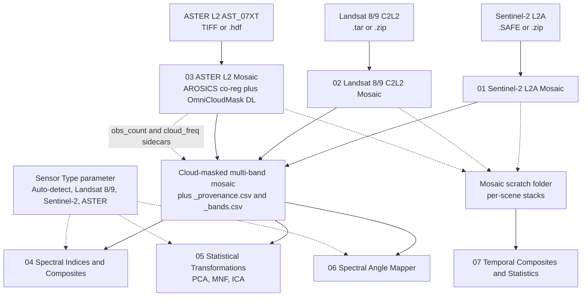
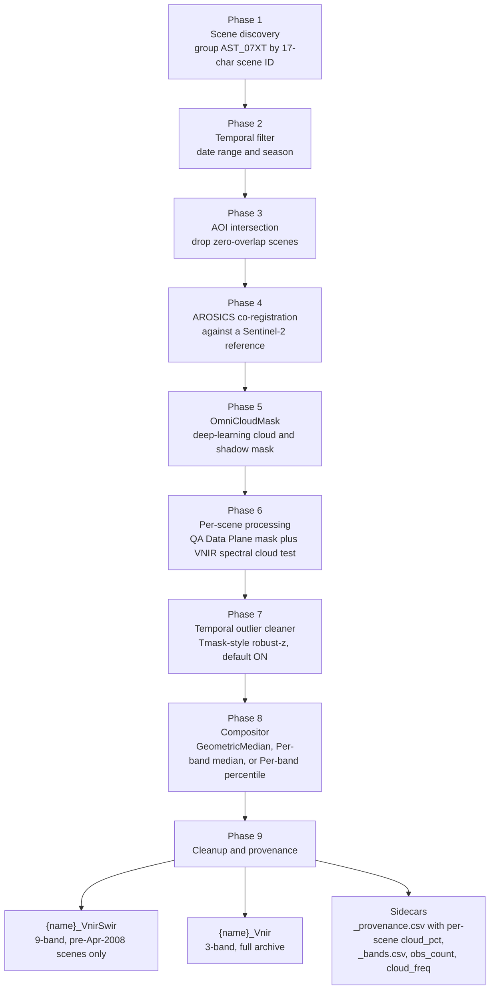

# GENESIS

> Multisensor Satellite Analysis Toolbox for ArcGIS Pro

[](https://opensource.org/licenses/Apache-2.0)
[](https://www.esri.com/en-us/arcgis/products/arcgis-pro/overview)
[](https://www.python.org)
[](https://github.com/PedroMMGoncalves/GENESIS/actions/workflows/ci.yml)
[](https://doi.org/10.5281/zenodo.20430828)

GENESIS is an ArcGIS Pro toolbox for analysing **Sentinel-2 L2A**,
**Landsat 8/9 Collection 2 Level 2**, and **ASTER L2 (AST_07XT)** imagery.
It has seven tools: a cloud-removed mosaicker for each sensor, plus
four sensor-agnostic tools for spectral indices and composites,
PCA / MNF / ICA statistical transformations, Spectral Angle Mapper
classification, and per-pixel temporal statistics built over the
mosaic scratch.
A `Sensor Type` parameter on the analysis tools selects the correct band
roles, indices, and reflectance scaling for the input data.

The toolbox was developed during the author's work on the **GENESIS**
Horizon Europe project (grant 101157447,
[genesisnbs.eu](https://genesisnbs.eu/faial/)) to produce cloud-removed
multisensor satellite mosaics for the **Faial Island** demonstrator site
in the Azores.

See [`CHANGELOG.md`](CHANGELOG.md) for release notes, including the breaking
and additive changes queued in the **Unreleased** section on top of v1.0.

## Contents

- [Workflow](#workflow)
- [Tools](#tools)
- [Sensor-aware design](#sensor-aware-design)
- [Requirements](#requirements)
- [Installation](#installation)
- [Input formats](#input-formats)
- [Output convention](#output-convention)
- [Tests](#tests)
- [Citation](#citation)
- [License](#license)
- [Acknowledgements](#acknowledgements)
- [Troubleshooting](#troubleshooting)
- [References](#references)

---

## Workflow

Three sensor families each have a dedicated cloud-removed mosaic tool. The cloud-masked mosaic plus its sidecars then feed the four sensor-aware analysis tools. Tool 07 reads the per-scene mosaic scratch folder rather than the final mosaic.



---

## Tools

The toolbox exposes seven tools in workflow order. The three mosaic tools (01-03) come first because the analysis tools (04-07) consume a mosaic or the mosaic scratch folder as input. Only Tool 03 needs extra installs (see [Requirements](#requirements)).

### At a glance

| # | Tool | One-liner | Sensor-aware | Extra installs |
| --- | --- | --- | :---: | :---: |
| 01 | Sentinel-2 L2A Mosaic | Cloud-masked S2 mosaic from .SAFE or .zip | n/a | no |
| 02 | Landsat 8/9 C2L2 Mosaic | Cloud-masked Landsat mosaic from EarthExplorer .tar | n/a | no |
| 03 | ASTER L2 Mosaic | Cloud-masked ASTER mosaic with sub-pixel co-registration and DL cloud mask | n/a | yes |
| 04 | Spectral Indices & Composites | Sensor-filtered indices and RGB composites | yes | no |
| 05 | Statistical Transformations | PCA, MNF, ICA with reusable .npz statistics | yes | no |
| 06 | Spectral Angle Mapper | Reference-spectra classification | yes | no |
| 07 | Temporal Composites & Statistics | Per-pixel temporal statistics over the mosaic scratch folder | n/a | no |

### Detailed reference

| # | Tool | Purpose |
| --- | --- | --- |
| **01** | Sentinel-2 L2A Mosaic | Cloud-masked mosaic from S2 `.SAFE` archives or `.zip` downloads. Aggressive SCL preset (classes 1, 3, 7, 8, 9, 10, 11) with a 3-pixel cloud-edge buffer by default; output is a 12-band stack (B01-B12 minus B10) with the 20 m and 60 m bands resampled to 10 m via BILINEAR |
| **02** | Landsat 8/9 C2L2 Mosaic | Cloud-masked mosaic from EarthExplorer `.tar` archives (QA_PIXEL bits 0-4 masked; multi-UTM-zone merging) |
| **03** | ASTER L2 Mosaic | Mineral-mapping mosaic from AST_07XT V004 (TIFF + HDF input; SWIR 30m → 15m). Nine-phase pipeline: scene discovery → temporal filter → AOI intersection (drops zero-overlap scenes) → **AROSICS co-registration against a Sentinel-2 reference image** ([Scheffler et al. 2017](https://doi.org/10.3390/rs9070676); mandatory, which corrects AST_07XT's L1B-grade ~20-50m per-scene geolocation drift that otherwise blurs the multi-scene median to ~30-50m effective resolution; applied as a global geotransform translation so the deshift is robust at any per-band resolution) → **deep-learning cloud + shadow mask via [OmniCloudMask](https://github.com/DPIRD-DMA/OmniCloudMask)** ([Wright et al. 2025](https://doi.org/10.1016/j.rse.2025.114694); mandatory primary cloud detection layer because AST_07XT ships without one, unlike S2 SCL / Landsat QA_PIXEL) → per-scene processing with QA Data Plane quality mask + hardened VNIR spectral cloud test as second-line defence (brightness + spectral flatness + NDVI guard + NDWI water guard + edge dilation) → temporal outlier cleaner (default ON; Tmask-style robust-z reduction; complementary to DL, catching per-pixel time-stack outliers DL doesn't see) → compositor (`arcpy.ia.GeometricMedian` default, with `Per-band median` and `Per-band percentile (p25 default)` alternatives, where the latter biases toward the darker quartile to discard cloud-bright residuals) → cleanup + provenance. **Dual output**: `{name}_VnirSwir_{compositor}` (9-band, pre-Apr-2008 scenes only, because the ASTER SWIR detector failed afterward) and `{name}_Vnir_{compositor}` (3-band, full archive). Ships `obs_count` + `cloud_freq` evidence-quality sidecars and a per-scene `cloud_pct` in the provenance CSV |
| **04** | Spectral Indices & Composites | ~25 indices + ~8 RGB composites, sensor-filtered to what each sensor can compute (red-edge for S2; per-wavelength SWIR minerals for ASTER) |
| **05** | Statistical Transformations | PCA, MNF, and ICA, a sensor-agnostic algorithm with persisted `.npz` statistics for cross-AOI re-application |
| **06** | Spectral Angle Mapper | Reference-spectra classification (table / training samples / endmember pixels) |
| **07** | Temporal Composites & Statistics | Per-pixel statistics over a mosaic-tool scratch folder: NDVI moments (min / max / mean / std + biome-tunable persistence), NDWI water occurrence frequency and an observation count map. With per-season stratification, also emits the Lv (2013) GDV ratio and the Eamus/Naumburg dry-season NDVI floor, both groundwater-dependent-vegetation indicators with published precedent. Built on `arcpy.sa.CellStatistics` (cleanroom Apache-licensed). |

All three mosaic tools write a `_provenance.csv` next to the output documenting every scene that contributed (scene ID, acquisition date, cloud cover, input path, processing baseline, toolbox version).

### ASTER (Tool 03) pipeline

Tool 03 runs a nine-phase pipeline. AROSICS sub-pixel co-registration (Phase 4) and OmniCloudMask deep-learning cloud and shadow masking (Phase 5) are both mandatory; the temporal outlier cleaner (Phase 7) is on by default.



### Resume on re-run

All three mosaic tools expose a **Preserve Scratch & Resume on Re-run** option under *Advanced Options*. When the option is on:

- Per-scene intermediate stacks are kept in a deterministically-named scratch folder beside the output geodatabase (e.g. `_genesis_s2_scratch_{mosaic_name}`) instead of being cleaned up at the end of the run.
- Each successfully written stack also writes a one-line `{scene_id}_stack.tif.complete` sentinel.
- Re-running with the same output name causes Phase 3 to skip any scene whose stack file *and* sentinel are both present, so the per-scene processing is reused as-is, the run jumps straight to the geometric-median stage.

A late-phase failure (e.g. a transient GP error during the median or AOI-mask step) therefore costs only the time of the failed phase, not the hours of per-scene QA / mask / resample / composite work that preceded it.

### Choosing a compositor

All three mosaic tools expose three compositor options in the *Advanced Options*: `GeometricMedian (default)`, `Per-band median`, and `Per-band percentile` (with a `percentile_value` parameter, default 25, range 5-50). The chosen compositor is reflected in the output filename (see [Filename convention](#filename-convention)) so two A/B runs over the same mosaic name produce distinct, self-documenting filenames. Empirical guidance based on the Faial demonstrator A/B runs:

- **Sparse-cloud or temperate AOIs** (long clear-sky baseline per pixel): `GeometricMedian` is the right default. It preserves same-scene spectral consistency across bands and the median is robust to a handful of cloud-contaminated outliers.
- **Persistent-cloud / orographic-cloud AOIs** (Faial caldera, Azores in general, tropical mountain ranges): **prefer `Per-band percentile` with `percentile_value=25`**. p25 biases each pixel toward the darker quartile of its time stack, discarding the bright cloud-contaminated observations that drag a temporal median upward when cloud is the modal observation at a pixel. Validated on Faial S2, Landsat, and ASTER 2026-05-28: GeometricMedian outputs showed residual cloud-brightness over the caldera floor and rim; p25 outputs cleaned the caldera, with the expected ~5-10% drop in band means (and ~10-15% drop in NIR, since vegetation NIR has the widest temporal distribution, so it falls most under a lower-percentile reducer).
- **Per-band median** (p50) is the middle option: explicit per-band NoData semantics like p25, but without the cloud-bias correction. Use as an A/B against GeometricMedian when you suspect GeometricMedian's NoData handling is producing artefacts but you don't want the darker bias of p25.

Spectral-consistency caveat for both Per-band variants: a pixel's band-1 value may come from a different scene than its band-2 value. Acceptable for visual mosaicking, NDVI, NDWI, brightness; less ideal for analyses that pull on tight cross-band ratios from the same observation (mineral mapping). The cleaner (default ON) handles per-pixel outlier rejection before the compositor reduces, so cleaner + p25 is the recommended stack for persistent-cloud AOIs.

---

## Sensor-aware design

Tools 04, 05, and 06 take a `Sensor Type` parameter (Auto-detect / Landsat 8/9 / Sentinel-2 / ASTER). The auto-detection reads the input raster's filename pattern or band count and resolves to the right sensor. Indices and composites are filtered at runtime to only what the selected sensor can compute: NDRE only appears for Sentinel-2, Alunite / Kaolinite / Muscovite / Calcite only for ASTER, Iron Oxide via Red/Blue for L8/9 and S2 (ASTER gets the Red/Green variant since it lacks a blue band).

| Sensor | Canonical band stack | Specific indices |
| --- | --- | --- |
| **Landsat 8/9** | 7 bands: SR_B1..SR_B7 (Coastal, Blue, Green, Red, NIR, SWIR1, SWIR2) | NDVI, NDWI, NDMI, NDBI, geological mineral ratios with Blue |
| **Sentinel-2** | 12 bands in wavelength order: B01, B02, B03, B04, B05, B06, B07, B08, B8A, B09, B11, B12 (B10 absent, Sen2Cor strips it during L1C→L2A atmospheric correction). 60 m bands (B01, B09) and 20 m bands are resampled to 10 m via BILINEAR; 10 m bands (B02, B03, B04, B08) are kept at native resolution. | NDVI, NDWI, NDMI, NDBI, geological mineral ratios with Blue, plus NDRE, CIred-edge, IRECI (red-edge) |
| **ASTER** | 9 bands: B01, B02, B03N, B04, B05, B06, B07, B08, B09 ¹ | Geological staples + Alunite, Kaolinite, Muscovite, Calcite, Hydrothermal Alteration (Cudahy) |

Each mosaic is shipped with a `{name}_bands.csv` sidecar documenting `band_index → satellite_band → role → wavelength_nm → native_res_m`. The CSV is the canonical map between the stack position the user sees in ArcGIS Pro's *Symbology* dropdown (e.g. `Band_4`) and the original sensor band name (e.g. `B04` / `SR_B4` / `ASTER B02`), because file-geodatabase rasters can't carry per-band descriptions, so the sidecar is the durable source of truth across both GeoTIFF and GDB outputs.

¹ Tool 03 emits **two outputs**: `{name}_VnirSwir` is the canonical 9-band mosaic built from pre-April-2008 scenes only (full VNIR + crosstalk-corrected SWIR), and `{name}_Vnir` is a 3-band (B01, B02, B03N) mosaic built from the full archive, because the ASTER SWIR detector failed in April 2008 and any post-failure scene contributes only to the VNIR-only product. Tool 04 detects the band count of its input automatically and skips indices that need SWIR roles when handed the 3-band variant. The 3-band output ships with its own `_bands.csv` (`aster-vnir` layout).

---

## Requirements

- **ArcGIS Pro 3.0 or higher** (Windows; `arcpy` is Windows-only on Pro 3.x)
- **Spatial Analyst** extension (required for all seven tools)
- **Image Analyst** extension (used by Mosaic and Transformations)
- Python 3.9+ with `numpy`, `scipy` and `matplotlib`, all three included with ArcGIS Pro's bundled Python (no other ML or scientific-computing dependencies; the FastICA used in Tool 05 is a pure-numpy in-house implementation, and `matplotlib` is used only by Tool 05's HTML report generator with the headless `Agg` backend)
- `osgeo.gdal` (also bundled with ArcGIS Pro), used by Tool 03 for HDF input
- `rasterio`, used by Tool 03 for the AROSICS per-band clip + deshift write path. Install into Pro's Python env via the Package Manager (`rasterio>=1.3`)

### Tool 03 (ASTER) additional dependencies (*mandatory*)

Tool 03's pipeline includes a DL cloud-mask stage and an AROSICS co-registration stage; both are required for it to run. All three additions install cleanly into a Pro-cloned `arcgispro-py3` environment, so there is no need for a separate conda env.

**Recommended setup (single env):**

1. In ArcGIS Pro → **Package Manager**, clone `arcgispro-py3` to a writable location (e.g. `D:\Genesis\ArcGISPRO_Environment\GENESIS\`) and **make the clone active**.
2. In Pro's **Python Command Prompt** (uses the active env), install the three extras:

   ```bash
   pip install omnicloudmask arosics rasterio
   ```

3. Install the **[Esri Deep Learning Frameworks](https://github.com/Esri/deep-learning-frameworks)** MSI matching your Pro release, which adds PyTorch + torchvision to the active env (CUDA-enabled build recommended; CPU-only works but is ~10-100× slower for OmniCloudMask inference). Without this step `omnicloudmask` will install but its lazy `import torch` raises at Phase 5.

Once the active env has `arcpy + torch + omnicloudmask + arosics + rasterio`, Tool 03 finds everything via its convention path (`<active_env>\python.exe`) and runs end-to-end. The library credits:

- **[OmniCloudMask](https://github.com/DPIRD-DMA/OmniCloudMask)**: sensor-agnostic R/G/NIR U-Net ensemble for cloud + shadow segmentation, Wright et al. 2025.
- **[AROSICS](https://github.com/GFZ/arosics)**: phase-correlation sub-pixel co-registration, Scheffler et al. 2017.

**Two-env fallback (advanced).** If your specific Pro version's pinned `gdal` / `pyproj` versions reject the `arosics` install in the clone, install `arosics` into a separate conda env (`conda create -n arosics_env -c conda-forge python=3.13 arosics rasterio`) and set `GENESIS_AROSICS_PYTHON=<that env's python.exe>` as a user environment variable. The toolbox spawns AROSICS in its own subprocess and discovers the env via that variable. Single-env install is the documented path; the two-env path exists only as a workaround.

**GPU (recommended)**: any CUDA-capable NVIDIA card with ≥6 GB VRAM. OmniCloudMask inference on a 254-scene ASTER archive completes in ~15 min on an RTX 4090; CPU-only takes hours. AROSICS itself is CPU-bound and benefits from any modern multi-core CPU.

Tools 01, 02, 04, 05, 06, 07 have *no* dependencies beyond the ArcGIS Pro base (numpy/scipy/matplotlib are bundled).

---

## Installation

1. Clone or download this repository.
2. Open **ArcGIS Pro**.
3. In the **Catalog** pane, right-click **Toolboxes** → **Add Toolbox**.
4. Navigate to `genesis_toolbox.pyt` and select it.
5. The seven tools appear under the **GENESIS Satellite Analysis Toolbox** in workflow order (01–07).

---

## Input formats

| Sensor | Accepted | Notes |
| --- | --- | --- |
| Sentinel-2 L2A | `.SAFE` folders or `.zip` Copernicus archives | Archives read on the fly via GDAL VSI (no extraction needed); browser-style duplicate-download suffixes (`(1).zip`) are deduped by canonical `PRODUCT_URI` from the archive's MTD XML |
| Landsat 8/9 | EarthExplorer `.tar` or `.zip` archives, or extracted scene folders | Both L2SR and L2SP accepted; archives read on the fly via GDAL VSI (no extraction needed) |
| ASTER | AST_07XT V004 per-band TIFFs or `.hdf` archives | TIFFs grouped by 17-char scene ID; HDF read via `osgeo.gdal`. The AST_08 thermal cloud test, present in earlier versions, was removed in the 2026-05-27 redesign when OmniCloudMask (Phase 5) became the mandatory primary cloud detection layer, since AST_08 SKT is clear-sky-only by construction (produced by the TES algorithm after the operational cloud mask) so it duplicates cloud information OmniCloudMask now handles natively |

---

## Output convention

### Filename convention

All three mosaic tools name their final output `{Mosaic Name}_{compositor_tag}`, where `compositor_tag` reflects the algorithm actually used:

| Compositor choice | Filename suffix | Example |
| --- | --- | --- |
| `GeometricMedian (default)` | `_Geomedian` | `Faial_V18_Geomedian` |
| `Per-band median` | `_PerBandMedian` | `Faial_V18_PerBandMedian` |
| `Per-band percentile (p25 default)` | `_PerBandP{N}` (`N` = percentile value) | `Faial_V18_PerBandP25` |

ASTER's two products keep the product axis (`_Vnir`, `_VnirSwir`) between the user-supplied name and the compositor tag, so the two outputs of a single run sort next to each other in Pro's Catalog: `Aster_V18_Vnir_PerBandP25` and `Aster_V18_VnirSwir_PerBandP25`.

Intermediates that exist internally, like `_UTM{zone}{H}` for Landsat per-zone work, `_T{mgrs}` for Sentinel-2 per-tile work, `_Merged` for Landsat multi-zone merges, `_Masked` for AOI-mask outputs, are dropped from the final user-facing filename via a post-processing rename, so the GDB Catalog shows one entry per run instead of a trail. The renames are recorded as a `# rename_audit` section appended to the provenance CSV (S2 and Landsat) so a post-mortem of an unexpectedly-named output can be done from the sidecar without scrolling the Pro message log. ASTER doesn't perform any renames (output filename is the final canonical name from the start) so its provenance CSV has no rename-audit section.

### General conventions

- Reflectance: **float 0–1** (analysis-friendly; Sentinel-2 ×0.0001, ASTER ×0.001 applied during ingestion)
- Mosaic CRS: inherited from input (UTM for Landsat / S2; resample-aligned for ASTER)
- Each mosaic: **multi-band GeoTIFF or geodatabase raster + `_provenance.csv` + `_bands.csv`** (band-mapping sidecar documenting which stack position is which satellite band)
- Tool 03 (ASTER) additionally emits per-pixel evidence-quality sidecars (`{name}_obs_count.tif` for valid clear observations per pixel, `{name}_cloud_freq.tif` for flagged fraction per pixel) tied to the AOI-masked output name; treat these as inputs to downstream uncertainty propagation, not as QA to discard. The `_provenance.csv` carries a `# run config: ...` header line documenting every threshold plus the temporal-cleaner `k` and `min_obs`, plus a `cloud_pct` column per scene showing the per-scene cloud-mask flagged fraction. The compositor choice (`GeometricMedian`, `Per-band median`, or `Per-band percentile(p=N)`) is recorded in the run-config header so A/B comparisons are self-documenting.
- Transformation statistics: each Tool 05 run emits THREE sidecars sharing the output raster's basename: a **`.npz`** (NumPy archive, machine-reloadable, so the fitted PCA/MNF/ICA can be re-applied to a new AOI without refitting), a **`.txt`** (human-readable numerical summary: eigenvalues, eigenvectors / mixing matrices, variance explained, mutual information, kurtosis, whichever applies) and a **`_report.html`** (self-contained dashboard with embedded matplotlib PNGs: scree / SNR / kurtosis plots and a loadings heatmap labelled with the satellite band names from `_bands.csv`). The HTML opens in any browser, works offline, and ships no external assets
- Tool 04 outputs: when the workspace is a **folder**, indices and composites are written to sibling `indices/` and `composites/` subfolders (forced GeoTIFF, no 13-character ESRI-GRID name limit). When the workspace is a **`.gdb`**, both products are saved flat at the workspace root with no extension (geodatabases have no name-length limit and don't support nested folders).
- Tool 05 outputs: the same folder / `.gdb` split applies. Folder workspaces get a per-transform subfolder (`pca/`, `mnf/`, or `ica/`) with the result saved as a `.tif`; `.gdb` workspaces save flat at the workspace root with no extension. Statistics (the `.npz` reloadable archive, the `.txt` human summary, and the `_report.html` dashboard, all three emitted for every transform) are co-located with the data by default, in the same folder as the `.tif` for folder workspaces, parent folder of the `.gdb` for geodatabase workspaces (GDB cannot store these sidecars). Set the optional *Statistics Folder* parameter explicitly to override the placement.
- Tool 07 outputs: a `temporal/` subfolder for folder workspaces (forced GeoTIFF) or flat at the workspace root for `.gdb`. Each indicator is a single-band raster prefixed with the user-chosen *Output Name Prefix*. *All scenes* stratification → 6-8 rasters (`{prefix}_NDVI_min/max/mean/std`, `{prefix}_NDVI_persistence`, `{prefix}_NDWI_max`, `{prefix}_NDWI_freq`, `{prefix}_obs_count`). *Per season* stratification → 12-16 rasters with `_dry` / `_wet` suffixes plus two cross-season composites (`{prefix}_GDV_ratio`, `{prefix}_GDV_dry_floor`). A `{prefix}_provenance.csv` sidecar lists the scenes that contributed to each group + the per-biome threshold tunables used (NDVI persistence threshold, GDV dry-floor / wet-min, seasonal pattern).
- Tools 04 and 05 preserve the input raster's valid-data footprint in every output. Mosaic rasters saved to a file geodatabase commonly arrive without explicit NoData metadata but with outside-AOI fill pixels written at value 0 (the U16 default Pro uses on save). Without a guard, derived indices / composites / PCA / MNF / ICA treat those zeros as valid samples and produce visible rectangular artefacts in the corners of the result extent. Tool 04 builds a self-mask from the first band (`band > 0` → valid) and applies it via `SetNull` to every output. Tool 05 layers three NoData defences before the eigendecomposition: `raster.noDataValue` from explicit metadata when set, `arcpy.sa.IsNull` on the multi-band raster (OR-collapsed across bands; catches band-level masks the `Raster.noDataValue` API does not surface), and an all-band-zero numpy fallback for inputs with no NoData metadata at all, converting matched pixels to `NaN` so they propagate through PCA / MNF / ICA and become NoData on save via the single `NumPyArrayToRaster(value_to_nodata=np.nan)` write. Either way the result's NoData footprint matches the input's; no AOI-mask parameter and no double-save needed.
- Each mosaic's median output is sanity-checked after save: per-band MIN / MEAN / MAX are logged, and a warning is emitted if any band's mean is suspiciously close to zero for that sensor's expected reflectance range, which catches the class of NoData-handling regression that would otherwise pass type-checking and structural validation while producing visually-broken outputs.

---

## Tests

A `pytest` regression suite under [`tests/`](tests/) covers the
pure-Python surface of the toolbox: sensor and band-role detection,
filename parsers (ASTER / Landsat / Sentinel-2), in-place archive
readers (`/vsitar/...`, `/vsizip/...`), the shared `time_type`
dropdown helpers (canonical label resolution, legacy snake_case
remap, required-companion validation), the compositor filename-tag
resolver, provenance CSV writers (including the rename-audit
trail), pure-numpy ICA, the per-band percentile compositor, the
OmniCloudMask observed-pixel reducer, the Tmask-style temporal
outlier cleaner, and Tool 07's per-biome NDVI persistence / GDV
threshold dispatch. The suite runs without ArcGIS Pro: a small
`arcpy` stub in [`tests/conftest.py`](tests/conftest.py) covers the
import-time surface so a stock CI runner can exercise the helpers.

```bash
python -m pytest tests -q
```

Each push and pull request runs the suite across Python 3.11 / 3.12 / 3.13
via the [CI workflow](.github/workflows/ci.yml). The 3.9+ shown in the badge
is the supported floor (the minimum Python bundled with ArcGIS Pro 3.0), while
CI runs the newer interpreters above. Raster-touching code
(CellStatistics, GeometricMedian, SetRasterProperties, …) is validated
through real mosaic runs against the Faial demonstrator data, not here.

Author-side scratch (probes, A/B drivers, audit scripts) lives under
`tests/_dev/` and is gitignored.

---

## Citation

If you use GENESIS in your research, please cite it via the metadata in
[`CITATION.cff`](CITATION.cff) (GitHub renders this in the sidebar as
"Cite this repository"). A versioned DOI is minted via Zenodo for each
release.

---

## License

Licensed under the **Apache License, Version 2.0**. See [`LICENSE`](LICENSE)
for the full text. In short: you can use, modify, and redistribute this
work commercially or otherwise, provided attribution is preserved; explicit
patent grant and patent-retaliation clauses apply per the Apache 2.0 terms.

---

## Acknowledgements

### Funding context

This toolbox was developed to support the author's analytical work on the **GENESIS** project ([genesisnbs.eu](https://genesisnbs.eu)), funded by the European Union's Horizon Europe research and innovation programme under grant agreement Nº **101157447**.

The author's contribution within GENESIS is the production of cloud-removed multisensor satellite mosaics and the organisation of derived information (spectral indices and statistical transformations were added as analytically useful extensions) for the [Faial demonstrator site](https://genesisnbs.eu/faial/). The Faial demonstrator is designing and building an aquifer storage and recovery system, using excess potable water accumulated in existing earth dams/watering ponds, to re-establish the freshwater supply capacity of *Furo das Cancelas*, the sole water source for ~3,000 inhabitants, and to counter saltwater intrusion in the coastal aquifer.

> Funded by the European Union. Views and opinions expressed are however those of the author(s) only and do not necessarily reflect those of the European Union or CINEA. Neither the European Union nor the granting authority can be held responsible for them.

---

## Troubleshooting

User-actionable errors most commonly hit on Tool 03 (ASTER); the other tools have very few moving parts and almost never fail except on input-data issues.

| Error / symptom | Likely cause | Resolution |
| --- | --- | --- |
| `ImportError: No module named 'omnicloudmask'` at Phase 5 | OmniCloudMask not installed in the active env | In Pro's Python Command Prompt: `pip install omnicloudmask`. Confirm the active env is your Pro-cloned env, not the read-only default. |
| `ImportError: No module named 'arosics'` or `Could not locate a Python env with AROSICS installed` | AROSICS not installed where the toolbox looks | Single-env install: `pip install arosics rasterio` in Pro's Package Manager. Two-env fallback: `conda create -n arosics_env -c conda-forge arosics rasterio` then set `GENESIS_AROSICS_PYTHON=<that env's python.exe>` as a user environment variable. See § "Tool 03 additional dependencies". |
| `RuntimeError: Could not load PyTorch / CUDA` at Phase 5 | Deep Learning Frameworks MSI not installed or version mismatched to Pro | Install [Esri Deep Learning Frameworks](https://github.com/Esri/deep-learning-frameworks) matching your Pro release. CPU-only PyTorch works but is ~10-100× slower. |
| Phase 5 OOM (out-of-memory) on GPU | OmniCloudMask inference exceeds GPU VRAM for very large scene grids | Either run on a GPU with ≥6 GB VRAM, or fall back to CPU inference (slow but works). Bigger AOIs may need a Pro restart between heavy runs to release CUDA memory. |
| `AROSICS reports no spatial overlap` per-scene failure | The scene's footprint catches the AOI only at a corner, or barely | Expected for marginal-coverage scenes; the run continues with surviving scenes. Phase 4's tail summary lists every per-scene failure. |
| `AROSICS could not fit a RANSAC model` per-scene failure | Too few valid tie points (sparse high-contrast features in the AOI) | Expected on small-AOI cloud-heavy scenes; not a bug. Lower `min_reliability` in `_worker_arosics_batch` to recover more tie points if needed (advanced). |
| `DONE: 0 mosaic(s) written` with no per-product error | Almost always a Phase 8 (compositor) silent failure caught by `except Exception: return None` | On versions before [`0298924`](https://github.com/PedroMMGoncalves/GENESIS/commit/0298924): Per-band median on a GDB output path hit `ERROR 010240 FGDBR`. On versions before [`4cfaad8`](https://github.com/PedroMMGoncalves/GENESIS/commit/4cfaad8): cross-product cleanup deleted the other product's cleaner output. Both fixed in the current release; if you see this on 1.0+, file an issue with the log. |
| Memory pressure when running all three mosaic tools in parallel | Each tool defaults to `subprocess_batch_size=10`; three tools = up to 30 concurrent worker python.exe processes | Drop `Subprocess Batch Size` to 5 in one or more tools, or stagger the launches. |

---

## References

### Co-registration

- *AROSICS (Tool 03 Phase 4, phase-correlation sub-pixel co-registration).* Scheffler, D., Hollstein, A., Diedrich, H., Segl, K., & Hostert, P. (2017). AROSICS: An automated and robust open-source image co-registration software for multi-sensor satellite data. *Remote Sensing*, 9(7), 676. <https://doi.org/10.3390/rs9070676>. The toolbox runs `COREG_LOCAL` against a Sentinel-2 NIR reference to find tie points, then applies the mean shift as a global geotransform translation (rather than the local deformation warp `DESHIFTER` defaults to) so the deshift is robust at any per-band resolution and never introduces resampling artefacts.

### Cloud masking

- *Landsat C2L2 QA_PIXEL.* USGS, 2020. *Landsat Collection 2 Level-2 Science Product Guide* (LSDS-1619). U.S. Geological Survey. Bit definitions for cloud, cloud-shadow, cirrus, dilated-cloud and fill flags.
- *Sentinel-2 SCL (Sen2Cor).* Main-Knorn, M., Pflug, B., Louis, J., Debaecker, V., Müller-Wilm, U., & Gascon, F. (2017). Sen2Cor for Sentinel-2. In *Image and Signal Processing for Remote Sensing XXIII* (Vol. 10427, 1042704). SPIE. <https://doi.org/10.1117/12.2278218>
- *ASTER QA Data Plane.* NASA LP DAAC. *AST_07XT: ASTER L2 Surface Reflectance VNIR and Crosstalk Corrected SWIR V004* product specification. <https://lpdaac.usgs.gov/products/ast_07xtv004/>
- *Tmask (per-pixel temporal outlier rejection).* Zhu, Z., & Woodcock, C. E. (2014). Automated cloud, cloud shadow, and snow detection in multitemporal Landsat data: An algorithm designed specifically for monitoring land cover change. *Remote Sensing of Environment*, 152, 217–234. <https://doi.org/10.1016/j.rse.2014.06.012>. The temporal-outlier principle the ASTER mosaic's Phase 6 cleaner implements as a robust-z reduction (median + MAD-derived sigma per pixel; the full Tmask uses RIRLS harmonic regression).
- *OmniCloudMask (deep-learning cloud + shadow segmentation, Tool 03 optional path).* Wright, N., et al. (2025). Training sensor-agnostic deep learning models for remote sensing: Achieving state-of-the-art cloud and cloud shadow identification with OmniCloudMask. *Remote Sensing of Environment*. <https://doi.org/10.1016/j.rse.2025.114694>. Sensor-agnostic R/G/NIR U-Net ensemble; outputs uint8 class rasters (0=Clear, 1=Thick, 2=Thin, 3=Shadow). ASTER VNIR sits inside the 10-50 m supported resolution range and matches the R/G/NIR input expectation.

### Statistical transformations

- *PCA.* Pearson, K. (1901). On lines and planes of closest fit to systems of points in space. *Philosophical Magazine*, 2(11), 559–572. <https://doi.org/10.1080/14786440109462720>
- *MNF.* Green, A. A., Berman, M., Switzer, P., & Craig, M. D. (1988). A transformation for ordering multispectral data in terms of image quality with implications for noise removal. *IEEE Transactions on Geoscience and Remote Sensing*, 26(1), 65–74. <https://doi.org/10.1109/36.3001>
- *ICA / FastICA.* Hyvärinen, A., & Oja, E. (2000). Independent component analysis: algorithms and applications. *Neural Networks*, 13(4–5), 411–430. <https://doi.org/10.1016/S0893-6080(00)00026-5>. The Hyvärinen parallel algorithm with symmetric decorrelation and the *logcosh* non-linearity is implemented in pure NumPy inside the toolbox (see `_fast_ica_numpy` in `genesis_toolbox.pyt`); no `scikit-learn` dependency.

### Spectral indices: vegetation, water, built-up

- *NDVI.* Rouse, J. W., Haas, R. H., Schell, J. A., & Deering, D. W. (1973). Monitoring vegetation systems in the Great Plains with ERTS. In *Third ERTS Symposium*, NASA SP-351 I, 309–317.
- *NDWI (water).* McFeeters, S. K. (1996). The use of the Normalized Difference Water Index (NDWI) in the delineation of open water features. *International Journal of Remote Sensing*, 17(7), 1425–1432. <https://doi.org/10.1080/01431169608948714>
- *NDMI / NDWI (vegetation moisture).* Gao, B.-C. (1996). NDWI, a normalized difference water index for remote sensing of vegetation liquid water from space. *Remote Sensing of Environment*, 58(3), 257–266. <https://doi.org/10.1016/S0034-4257(96)00067-3>
- *NDBI.* Zha, Y., Gao, J., & Ni, S. (2003). Use of normalized difference built-up index in automatically mapping urban areas from TM imagery. *International Journal of Remote Sensing*, 24(3), 583–594. <https://doi.org/10.1080/01431160304987>
- *Red-edge indices (NDRE, CIred-edge, IRECI, Sentinel-2 only).* Gitelson, A. A., Viña, A., Ciganda, V., Rundquist, D. C., & Arkebauer, T. J. (2005). Remote estimation of canopy chlorophyll content in crops. *Geophysical Research Letters*, 32, L08403. <https://doi.org/10.1029/2005GL022688>; Frampton, W. J., Dash, J., Watmough, G., & Milton, E. J. (2013). Evaluating the capabilities of Sentinel-2 for quantitative estimation of biophysical variables in vegetation. *ISPRS Journal of Photogrammetry and Remote Sensing*, 82, 83–92. <https://doi.org/10.1016/j.isprsjprs.2013.04.007>

### Spectral indices: geological / mineralogical

- *Iron oxide (Red/Blue and Red/Green ratios).* Sabins, F. F. (1999). Remote sensing for mineral exploration. *Ore Geology Reviews*, 14(3–4), 157–183. <https://doi.org/10.1016/S0169-1368(99)00007-4>
- *ASTER hydrothermal alteration indices (Cudahy method).* Cudahy, T. (2012). *Satellite ASTER Geoscience Product Notes for Australia* (version 1, CSIRO Report EP-30-07-12-44). CSIRO. Defines per-band ratios for alteration, ferric iron, ferrous iron, AlOH, MgOH, FeOH and quartz indices.
- *Clay / Alunite / Kaolinite / Muscovite (ASTER SWIR ratios).* Mars, J. C., & Rowan, L. C. (2006). Regional mapping of phyllic- and argillic-altered rocks in the Zagros magmatic arc, Iran, using Advanced Spaceborne Thermal Emission and Reflection Radiometer (ASTER) data and logical operator algorithms. *Geosphere*, 2(3), 161–186. <https://doi.org/10.1130/GES00044.1>
- *Carbonate / Calcite (ASTER B7/B8 ratio).* Rowan, L. C., & Mars, J. C. (2003). Lithologic mapping in the Mountain Pass, California area using Advanced Spaceborne Thermal Emission and Reflection Radiometer (ASTER) data. *Remote Sensing of Environment*, 84(3), 350–366. <https://doi.org/10.1016/S0034-4257(02)00127-X>

### Compositing

- *Geometric median for temporal pixel reduction.* Roberts, D., Mueller, N., & McIntyre, A. (2017). High-dimensional pixel composites from earth observation time series. *IEEE Transactions on Geoscience and Remote Sensing*, 55(11), 6254–6264. <https://doi.org/10.1109/TGRS.2017.2723896> (the algorithm Esri's `arcpy.ia.GeometricMedian` implements, called by all three mosaic tools)

### Classification

- *Spectral Angle Mapper.* Kruse, F. A., Lefkoff, A. B., Boardman, J. W., Heidebrecht, K. B., Shapiro, A. T., Barloon, P. J., & Goetz, A. F. H. (1993). The Spectral Image Processing System (SIPS), interactive visualization and analysis of imaging spectrometer data. *Remote Sensing of Environment*, 44(2–3), 145–163. <https://doi.org/10.1016/0034-4257(93)90013-N>

---

> **Provenance note.** This toolbox is independently authored work used in support of GENESIS analytical tasks at the Faial demonstrator site. It is **not an official deliverable** of the GENESIS Horizon Europe consortium. For formal project deliverables, see [genesisnbs.eu](https://genesisnbs.eu) and the [Faial demonstrator page](https://genesisnbs.eu/faial/).
